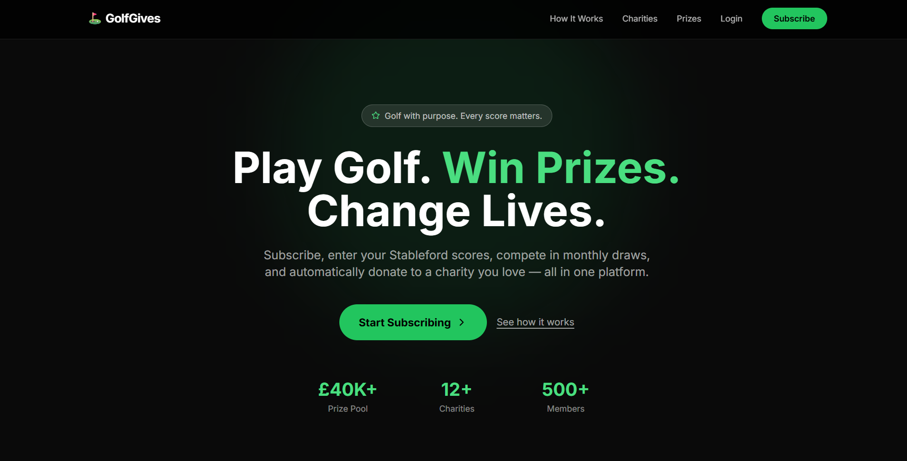
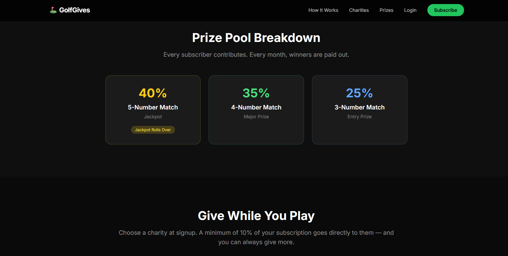
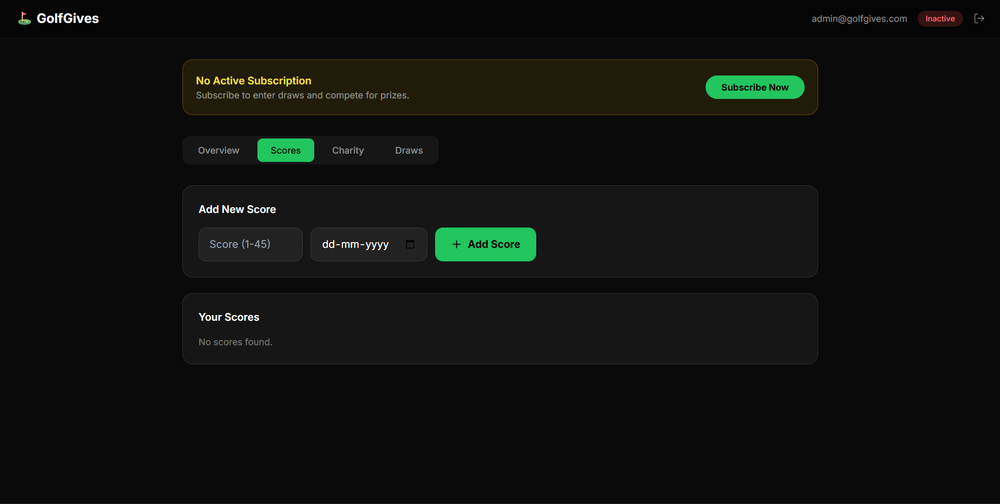
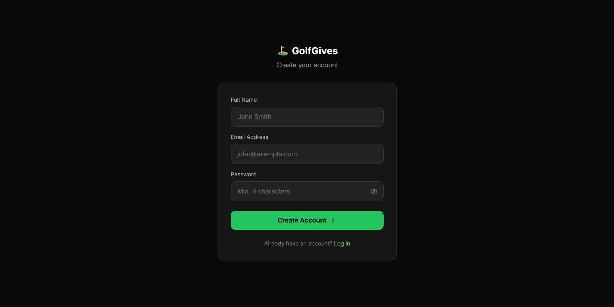
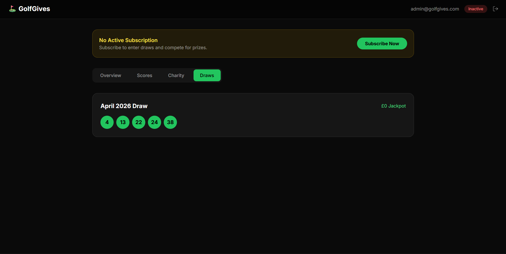
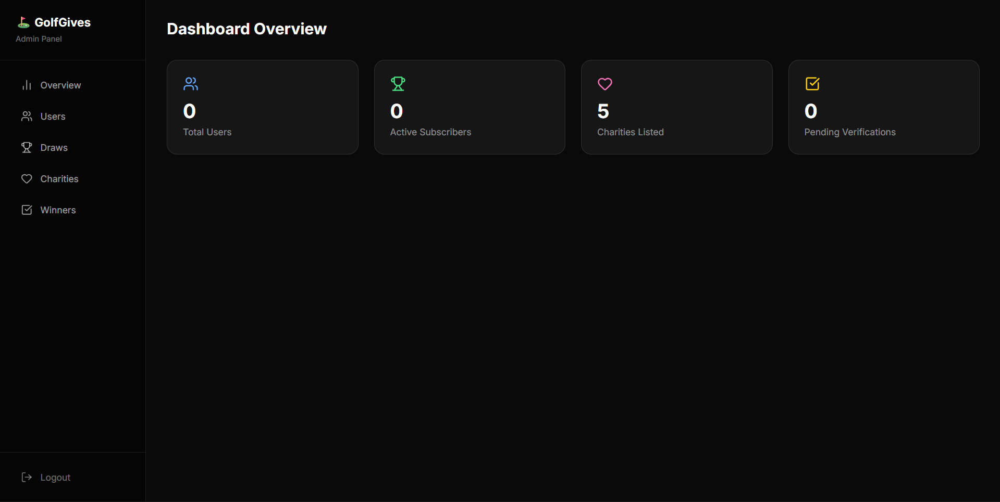
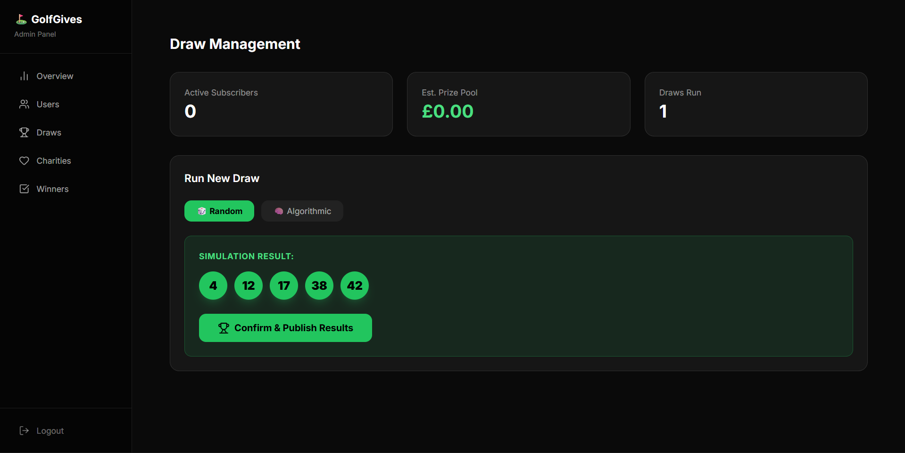

# ⛳ GolfGives — Golf Charity Subscription Platform

> Built as part of the Digital Heroes Full-Stack Development Trainee Selection Process.

GolfGives is a modern, full-stack subscription platform where golfers track their Stableford scores, compete in monthly prize draws, and automatically donate to a charity of their choice — all in one beautifully designed application.

---

## 🌐 Live Demo

| Link | URL |
|------|-----|
| 🏠 Homepage | https://your-app.vercel.app |
| 👤 User Dashboard | https://your-app.vercel.app/dashboard |
| 🔧 Admin Panel | https://your-app.vercel.app/admin |

**Test Credentials:**

| Role | Email | Password |
|------|-------|----------|
| User | tanishgoyal08@gmail.com | 123456 |
| Admin | admin@golfgives.com | Admin@123456 |

---

## 📸 Screenshots

### Homepage

### User Dashboard — Overview

### Score Management

### Charity Selection

### Draw Results

### Admin Panel

### Admin Draw Engine

---

## 🚀 Key Features

### 👤 User Features
- Secure signup, login and session management via Supabase Auth
- Subscription management via Stripe (Monthly £9.99 / Yearly £99.99)
- Rolling score logic — only the latest 5 Stableford scores are kept (1–45 range)
- Charity selection with adjustable contribution percentage (min 10%)
- Monthly draw results visible in dashboard
- Winnings overview with payment status

### 🔧 Admin Features
- Full user management — view, activate, deactivate subscriptions
- Draw engine with two modes:
  - 🎲 **Random** — standard lottery-style
  - 🧠 **Algorithmic** — weighted by most frequent user scores
- Simulation mode before publishing draws
- Prize pool auto-calculation (40% jackpot / 35% 4-match / 25% 3-match)
- Jackpot rollover if no 5-match winner
- Winner verification — Approve / Reject submissions
- Payout tracking — Pending → Paid
- Charity management — Add, edit, delete listings

---

## 🏗️ System Architecture

### Database Schema (Supabase/PostgreSQL)
